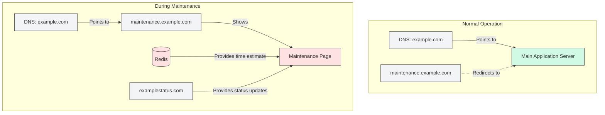
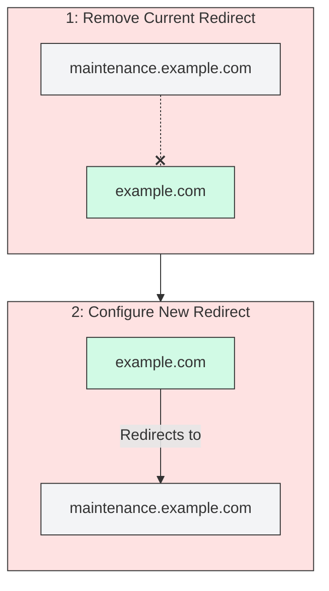
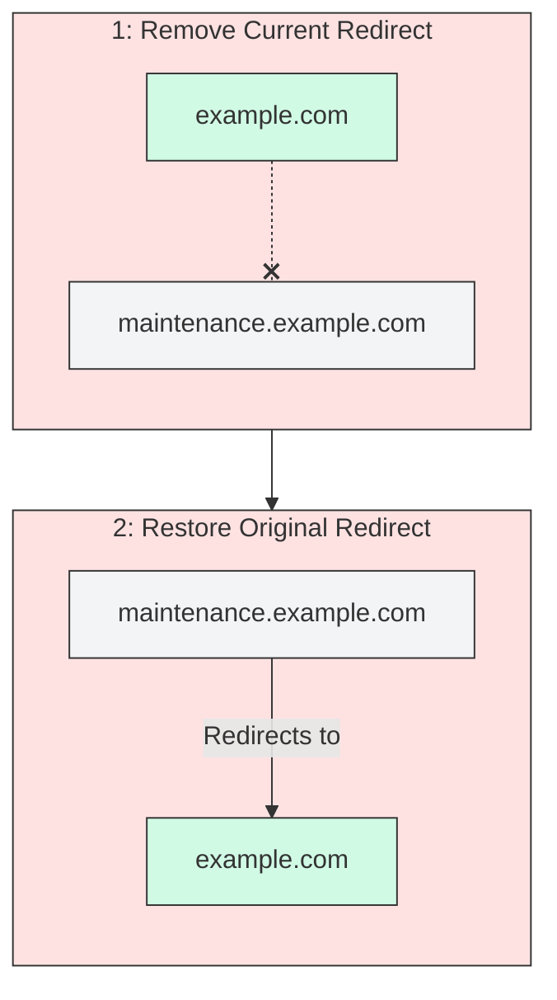

# maintenance-page

A simple maintenance page that shows the estimated time remaining for a maintenance event.

## Overview

This page is served from an Astro application. The time estimate is provided by a Redis database.



### Use cases

You can use this page to inform users that the site is undergoing maintenance.

## Installation

### Requirements

- A Redis database
- [Vercel](https://vercel.com) for deployment (or another site host)

### Environment Variables

See [.env.example](.env.example).

## Usage

### Maintenance Configuration Hash Fields

| Field       | Type              | Format            | Description                                                                                         |
| ----------- | ----------------- | ----------------- | --------------------------------------------------------------------------------------------------- |
| endTime     | string (optional) | ISO 8601          | The UTC timestamp when maintenance is scheduled to end                                              |
| enabled     | string            | "true" or "false" | Whether maintenance mode is currently active. If false, traffic is redirected to the `redirectUrl`. |
| redirectUrl | string            | URL               | The destination URL for redirecting traffic during maintenance                                      |

### Enabling maintenance mode



### Disabling maintenance mode



## Deployment

See [.envrc.example](.envrc.example) for the environment variables you need to set.

```bash
# Pull the environment information.
VERCEL_PROJECT_ID=$VERCEL_MAINTENANCE_PAGE_PROJECT_ID vercel pull --yes --environment=production --scope=gnometeaparty --token=$VERCEL_TOKEN

# Copy the Vercel environment variables.
cp .vercel/.env.production.local .env.production.local

# Build the project artifacts.
vercel build --prod

# Deploy the project artifacts to Vercel.
VERCEL_PROJECT_ID=$VERCEL_MAINTENANCE_PAGE_PROJECT_ID vercel deploy --prebuilt --prod --token=$VERCEL_TOKEN
```

## Additional Information

For any issues or feature requests, please open an issue on the repository.
